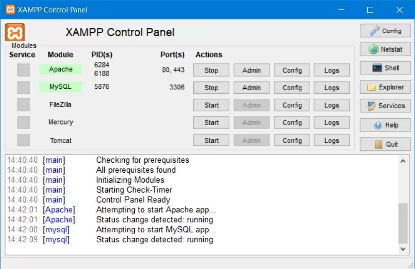

# 1.0 Installation af XAMPP
PHP er et fortolket programmeringssprog. Det betyder at sproget er afhængigt af et bestemt miljø for at kunne afvikles. I PHP's tilfælde er den optimale løsning en Linux med en Apache webserver med PHP og MySQL. 

På en Windows maskine - og til dels også Mac - er vi nødt til at simulere dette miljø og det kan vi gøre med XAMPP. 

XAMPP er en programpakke som kan afvikle en Apache webserver, PHP og MySQL på din lokale maskine.

## Hent XAMPP
Du kan downloade den sidste nye version af XAMPP her: https://www.apachefriends.org/download.html

Husk at vælge den version der passer til dit styresystem (Windows, OSX, Linux).

## Installer XAMPP
Klik på installationsfilen og følg guiden. Denne guide tager udgangspunkt i en window installation.

1. Sæt som minimum kryds i følgende under *Select components*:
	- Server
		- Apache
		- MySQL
	- Programming languages
		- PHP

2. Vælg installationsfolder
	- `C:\xampp`

3. Fjern krydset omkring mere info fra Bitnami

Når installationen er færdig kan du åbne XAMPP's kontrolpanel:

Her kan du starte og stoppe de forskellige processer samt få en hurtig adgang til deres konfigurations- og logfiler.

Klik på *Start* knappen ud for Apache for at starte din webserver.

